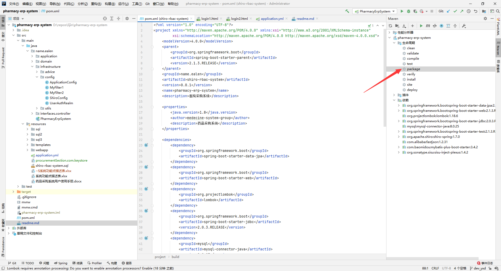

零件采购跟踪管理系统
=================

## 1.所需运行环境

i. `mysql 8`版本的数据库服务器

ii. `java 8`以上运行环境

iii. 带有文件系统的主流配置的服务器（windows或linux系统）

### 2.部署

#### i. 在windows中部署：

第一步：使用maven工具打包项目，并新建一个专门用来放置服务器程序的目录A，将打包后的jar包复制到目录A中



第二步：找到项目中的`src/main/resources/application.yml`文件，复制到目录A中

第三步：修改`application.yml`文件中的配置

##### 需要修改的配置有：

a.服务端口

b.`mysql`数据源链接、用户名、密码、数据库

#### ii. 在linux中部署：

同上

### 3.注意事项

`src/main/resources/sql/system.sql`文件包含了样例数据库数据，可供测试使用

### 4.系统设计相关文档

#### i.功能设计

#### ii.后端接口


#### iii.数据库逻辑设计

*reviewer(employee_id)* 

> 员工表 
> 
> 审核员工的工号，主键为employee_id，自增，类型为int

*projects(projects_id,projects_name,projects_start_time,projects_end_time,projects_manager)*

> 项目表 
> 
> projects_id是员工编号，也是主键，不自增，类型为int，projects_name为工程名，类型为varchar，projects_start_time为项目开始时间，精确到天，projects_end_time为项目结束时间，精确到天，projects_manager_name为项目负责人名称，和审核员工无关，类型为varchar

*manufacturer(usccode,manufacturer_name,address,agent,telephone_number)*

> 制造商表
> 
> 统一社会信用代码 Unified social credit code简写为usccode 作为主键，类型varchar 示例：91370703MA3WWUPB7H。manufacturer_name 制造商名称，类型 varcahr。address 制造商地址。类型varchar，agent代理人，类型varchar。telephone_number电话号，类型varchar

*parts(part_id,part_name,part_usage_description,part_accuracy_dimension_grade)*

> 零件表
> 
> part_id零件编号，类型int；part_name零件名称，类型varchar；part_usage_description零件用途描述，类型varchcar；part_accuracy_dimension_grade零件尺寸精度等级，类型int

*production(usccode,part_id)*

>生产表
>  
> usccode和part_id的集合作为主键；外键约束，usccode来自manufacturer表，part_id来自parts表

*quotation(usccode,part_id,projects_id,procurement_status,price,quantity)*
> 
> 报价单（采购表）
> 
> usccode,part_id,projects_id的集合作为主键；
> usccode,part_id是外键约束，该属性集的内容必须来自生产表；
> procurement_status是采购状态；
> price价格；
> quantity采购数量；

### 5.补充说明

#### i.mysql 不支持check 但是可以用触发器弥补，默认man的role为0，viewer的role_id为1

#### ii.mysql 触发器代码
```sql
CREATE TRIGGER queryBeforeInsert BEFORE INSERT ON `system_relation_user_role`
FOR EACH ROW
BEGIN
IF (SELECT COUNT(*) FROM `system_relation_user_role` WHERE user_id=NEW.user_id AND role_id=NEW.role_id) THEN
END IF;
END;
```